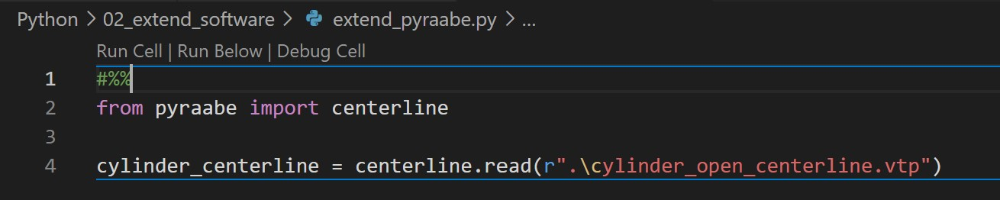
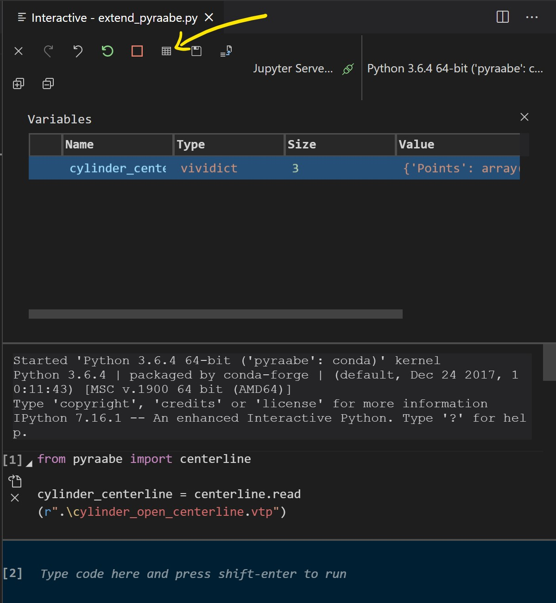

# Python - Extending existing software

## Setup
For this example, we'll use the open source package PyRaabe to get acquainted with reading and using someone else's code. PyRaabe identifies the connectivity of an airway tree and returns that information, along with the average diameter of each airway branch and a file that graphically shows the centerlines for the airways (a voronoi computation of the medial axis of free space, generated by the Vascular Modeling Toolkit).

[PyRaabe is available on GitHub](https://github.com/pnnl/pyraabe), and if you have GitHub working on your computer, that might be a good way to access it. However, if you don't have an account or don't want to use it, you can manually download the files as a .zip archive. The authors have provided a good description of how to get started. Here's exactly what I did. 

1. Download .zip (Code dropdown > zip)

2. Start Anaconda Prompt or use the terminal in VS Code and run the following. If it fails, you may need to run as admin, then go back to regular cmd

        conda update conda anaconda-client

3. Execute this line

        conda create -n pyraabe -c vmtk -c conda-forge python=3.6 itk vtk vmtk numpy scipy pandas

    This creates a virtual environment where libraries for scientific computing are installed. This is separate from the base Anaconda environment, so you need to move into the new environment with

        conda activate pyraabe

4. Back in your files, make a directory where you can extract the zipped folder. Extract it and move the contents to the top. My file structure looks like this:

        /folder
        |--pyraabe-master.zip
        |--pyraabe
            |--pyraabe
            |--LICENSE
            |--README.md
            |--etc

5. In the shell, navigate to /folder and use `pip` to install PyRaabe

        cd C:\[specific to your computer]\folder
        pip install ./pyraabe

    Hopefully the output shows something like this towards the end:

        Successfully built pyraabe
        Installing collected packages: pyraabe
        Successfully installed pyraabe-0.1.0

6. Download the `cylinder_open.stl` file to your working directory. The general format of the command line tool for PyRaabe is listed in its README, and it follows the format below. In this example, you can use the following command. Make sure you're in the right directory!

        pyraabe [path_to_your_directory]\file.stl [path_to_your_directory] --gravity [x] [y] [z]

        pyraabe .\cylinder_open.stl . --gravity 0 -1 0

   If it works, a new window should pop up. Follow the instructions, and you should have two new files. If you want to view the .vtp file, [ParaView](https://www.paraview.org/) is a good option. You can load the centerline and the stl into ParaView and decrease the opacity on the stl to compare the results.

        cylinder_open_centerline.vtp
        cylinder_open_raabe.tsv

7. Now you can use the command line tool if you're interested in the default output -- a centerline file and a Raabe table. We can also look into the methods used in the pyRaabe code. What I wanted to access was the data associated with the centerline, which would allow you to determine the centerline diameter at a point in space. While you still have Anaconda prompt open, it will be helpful to install a few more packages in this virtual environment.

        conda install pylint
        conda install ipykernel

    These assist with VS Code. Specifically, they help with linting and running an interactive Python session. 

    > Linting highlights syntactical and stylistic problems in your Python source code, which oftentimes helps you identify and correct subtle programming errors or unconventional coding practices that can lead to errors. For example, linting detects use of an uninitialized or undefined variable, calls to undefined functions, missing parentheses, and even more subtle issues such as attempting to redefine built-in types or functions. Linting is thus distinct from Formatting because linting analyzes how the code runs and detects errors whereas formatting only restructures how code appears. [Source](https://code.visualstudio.com/docs/python/linting)

## Extending PyRaabe
If you follow the source (look at `cli.py`), you'll see that the centerline module contains the code that takes the STL file, finds the centerline, and records the [x, y, z] coordinates and diameter (specifically, maximum inscribed sphere radius). Unfortunately, PyRaabe as-written itself doesn't report that information (possibly because the average diameter is a safer measurement or just more accepted by the lung research community). A simple way to think about "extending" software is adding functionality, and it's one advantage to using open-source programs. Let's extend PyRaabe to give us some additional data with the centerline output.

1. Start a new script, `extend_pyraabe.py`. 

2. In order to call any definition in the centerlines module, you need to import PyRaabe. Remember, as long as you're working in the `pyraabe` conda environment, pyraabe is installed and automatically available to you in any script or directory. We can start with a short example here.

        from pyraabe import centerline

        cylinder_centerline = centerline.read(r".\cylinder_open_centerline.vtp")

3. Run the script, and... it looks like nothing happened. Here's where `ipykernel` becomes useful. In the first line, add `#%%`, and a new menu should appear above the code (shown below).

    

    If you click "Run Cell", an interactive Python window opens, which allows you to run Python code one line at a time and view variables you have defined. Click the button that looks like a datatable to confirm that the cylinder_centerline you just defined is actually there.

    

    From here, you can start to build your own functionality into pyraabe's existing code.

4. In order to get the coordinates and diameter, we'll borrow from the expertise of the authors to get the dataframe and write it to a file. 

        #%% Imports
        import pyraabe
        import os

        #%% Get the [x,y,z] and radius
        # Set the path to the file for which centerlines should be calculated
        infile = r".\cylinder_open.stl"

        # Set the filenames for output
        filename_prefix = os.path.splitext(infile)[0]
        centerline_path = os.path.join(filename_prefix + '_centerline.vtp')
        data_path = os.path.join(filename_prefix + '_coords.csv')

        # Extract centerline, unless it already exists (if you need to recalculate, change the name of the original)
        if not os.path.exists(centerline_path):
            pyraabe.centerline.compute(infile, centerline_path)
        else:
            print('{} already exists. Skipping centerline calculation.'.format(centerline_path))

        # Get centerline data and write to csv
        new_centerline = pyraabe.centerline.read(centerline_path)
        data = pyraabe.centerline.to_dataframe(new_centerline)
        data.to_csv(data_path)
        

## Outlook
Now you can take a look at the csv output. Does it look correct? What factors might affect the accuracy of these results? What happens if you use `cylinder_capped.stl`?That's beyond the scope of this document, but now you know that you go into an existing piece of code and extract the methods, definitions, or other information you might need for your own work.